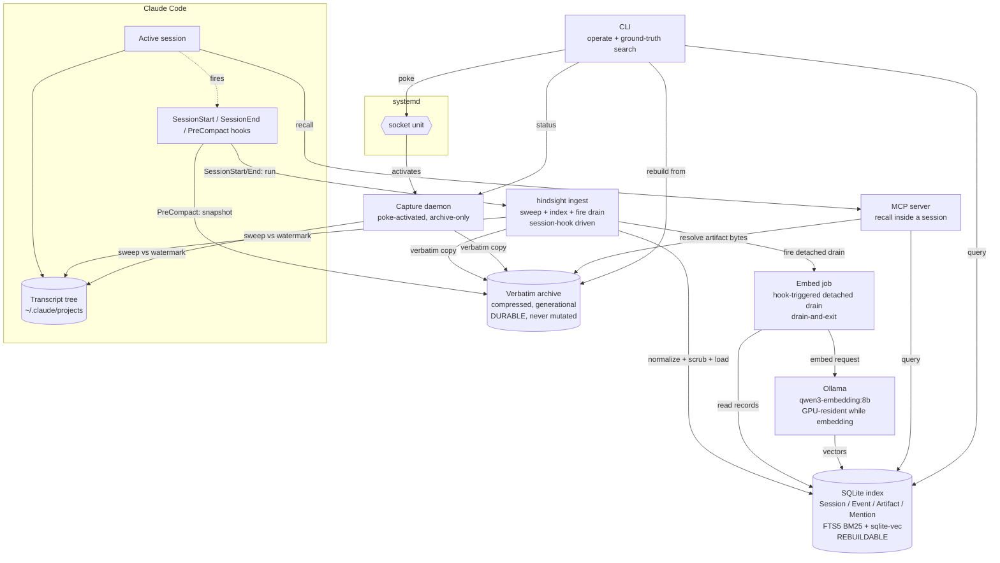
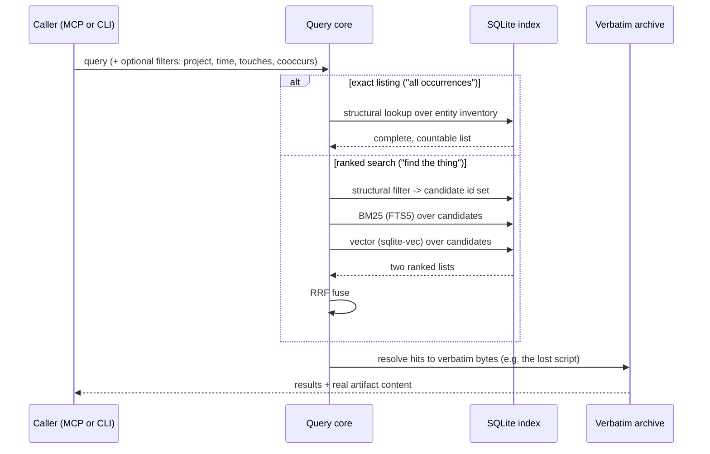
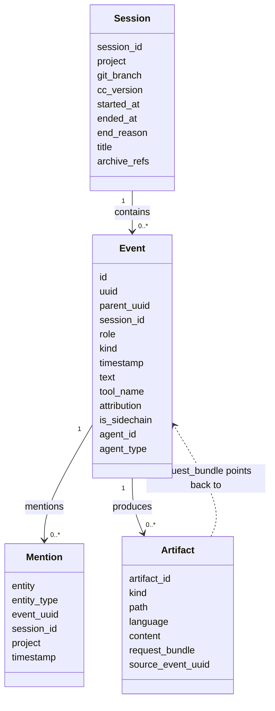
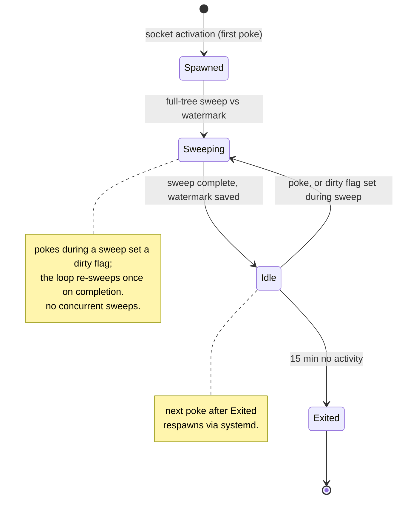

# Hindsight diagrams

These are the living UML views of the design. They are kept in sync with the [decision
records](decisions) as the design changes. If a diagram and an ADR disagree, the ADR is right
and the diagram is a bug.

Rendered with Mermaid, which GitHub displays inline.

## Component view

Where the pieces live and how data moves between them. Solid arrows are data flow. The session
hooks run `hindsight ingest`, which sweeps, indexes, and fires the embed drain; PreCompact
snapshots one transcript straight to the archive; the poke-activated capture daemon is the
archive-only path for a manual `hindsight poke`.



## Capture and ingest sequence

One `hindsight ingest` pass, from a session hook to data at rest. Backfill is this same
sequence over an empty watermark and an empty ingest ledger, so every session looks new.

```mermaid
sequenceDiagram
    participant H as Session hook
    participant I as hindsight ingest
    participant T as Transcript tree
    participant A as Verbatim archive
    participant X as SQLite index
    participant E as Embed drain

    H->>I: SessionStart/End runs `hindsight ingest`
    I->>T: sweep: stat-walk, diff against watermark
    T-->>I: changed / new session files
    Note over I,A: unchanged -> skip. grew -> re-copy generation.\nrewritten (compaction) -> new generation, old one kept.
    I->>A: verbatim copy (never mutated), advance watermark
    Note over I: fingerprint each archived session vs ingest_ledger;\nunchanged sessions skipped
    I->>X: normalize, scrub secrets, session-scoped replace of\nchanged sessions' records + FTS
    Note over I,X: exact + lexical recall live here already
    I->>E: fire `hindsight embed --detach` iff a session changed
    Note over E: detached, always-GPU drain reads records and writes\nvectors, embedding only new units; semantic recall catches up
    I->>I: update ingest_ledger fingerprints
```

## Query sequence

Two paths. Exact listing is recall-complete and unranked. Ranked search fuses lexical and
semantic, narrowed first by structural filters.



## Data model

The four normalized record types and how they relate. All are derived from the archive and
rebuilt by normalize.



## Daemon lifecycle

The state machine behind socket activation and idle self-termination.


