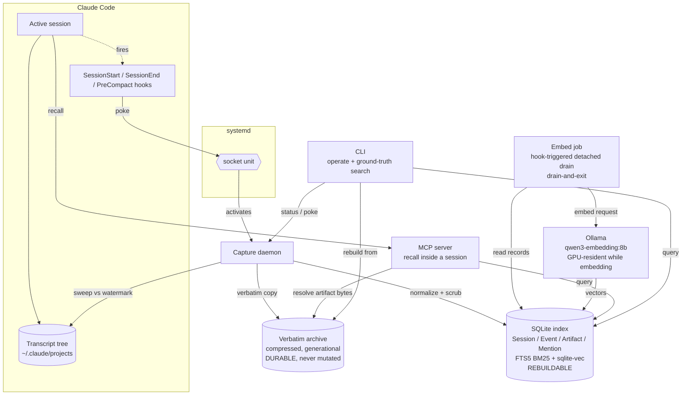
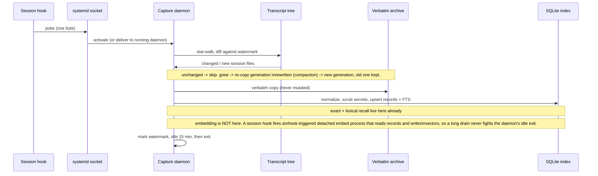
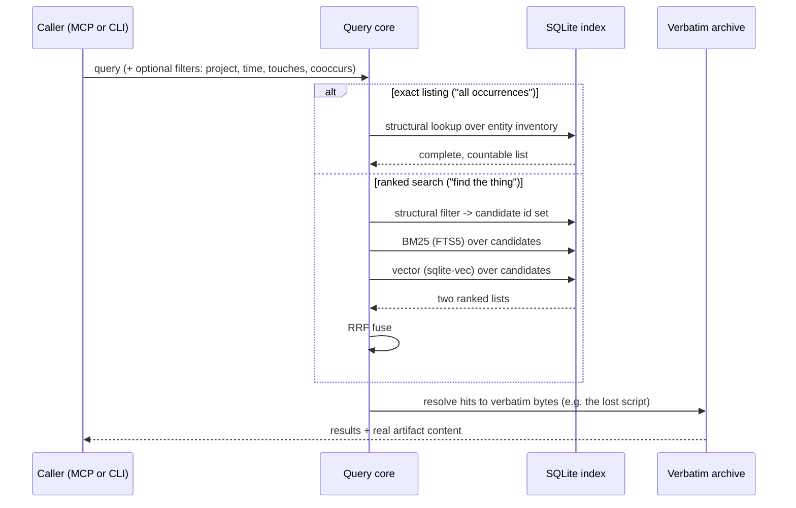
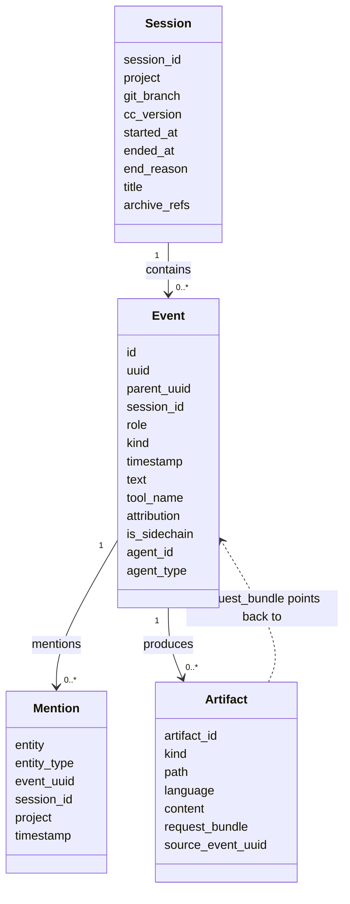
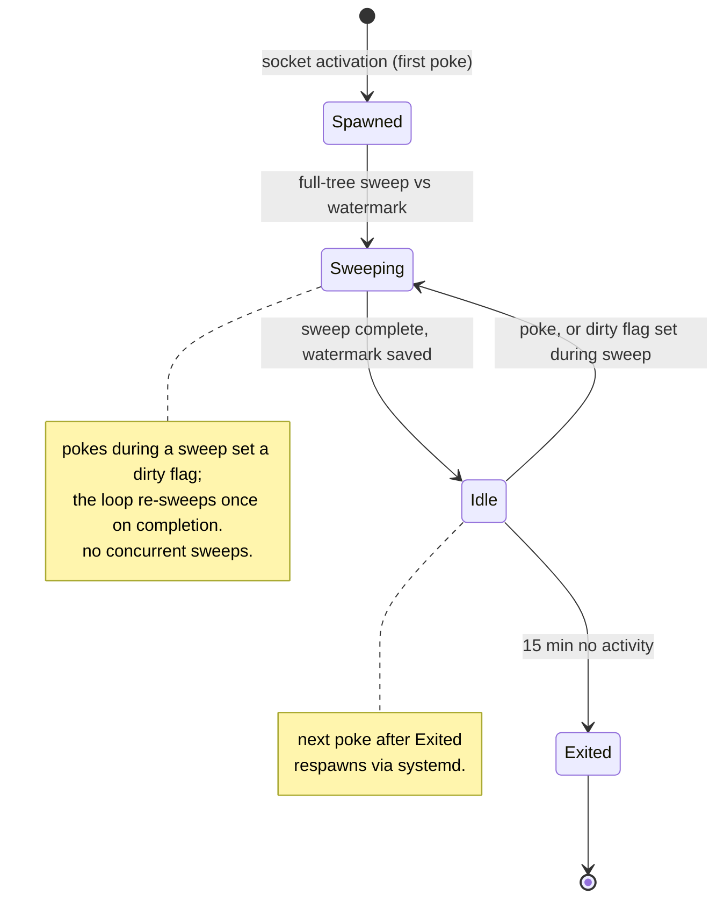

# Hindsight diagrams

These are the living UML views of the design. They are kept in sync with the [decision
records](decisions) as the design changes. If a diagram and an ADR disagree, the ADR is right
and the diagram is a bug.

Rendered with Mermaid, which GitHub displays inline.

## Component view

Where the pieces live and how data moves between them. Solid arrows are data flow, the hook
poke is control.

## Capture sequence

One sweep, from a hook poke to data at rest. Backfill is this same sequence with an empty
watermark, so every session looks new.

## Query sequence

Two paths. Exact listing is recall-complete and unranked. Ranked search fuses lexical and
semantic, narrowed first by structural filters.

## Data model

The four normalized record types and how they relate. All are derived from the archive and
rebuilt by normalize.

## Daemon lifecycle

The state machine behind socket activation and idle self-termination.

